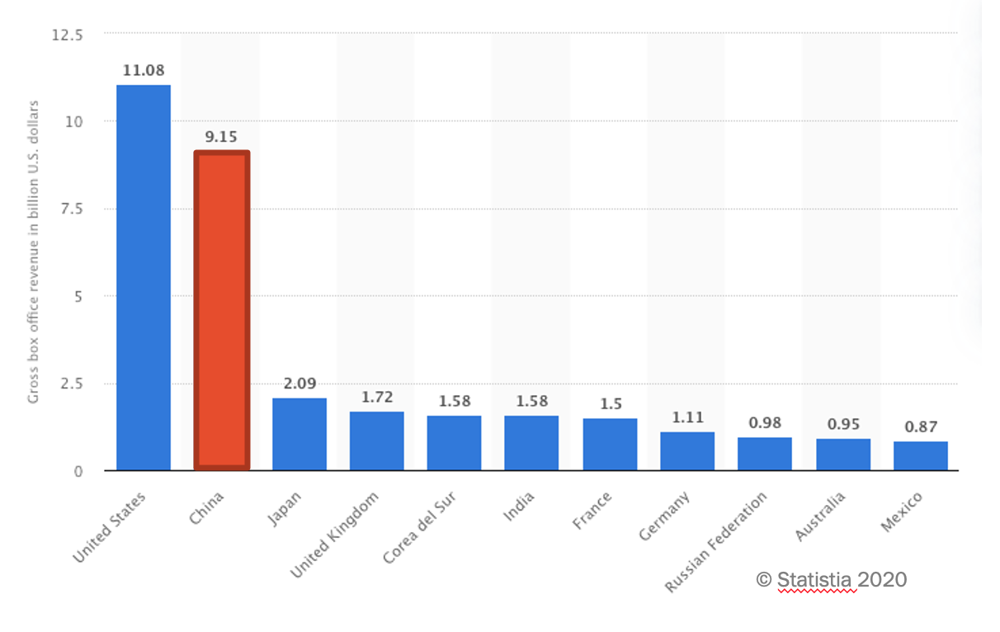
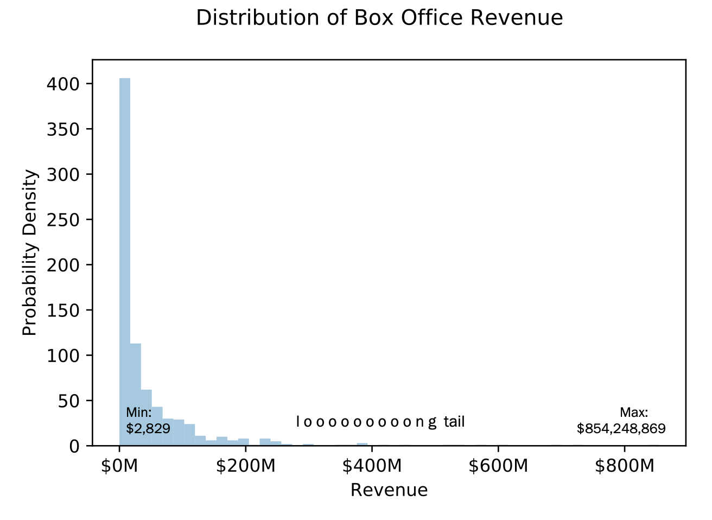
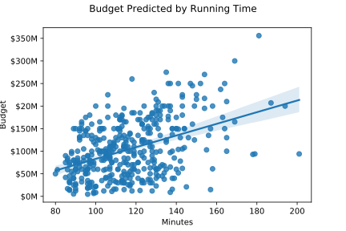
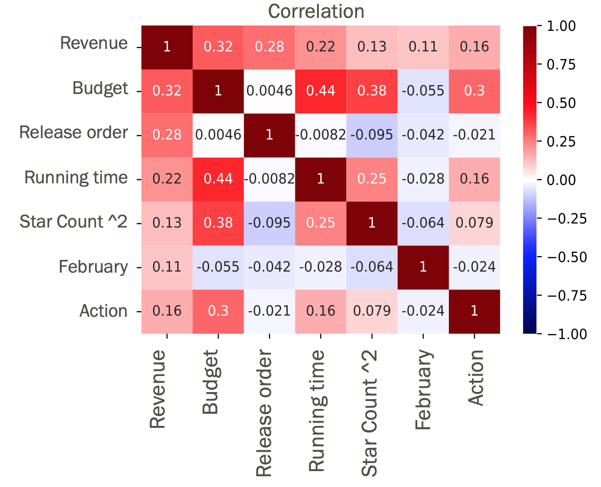
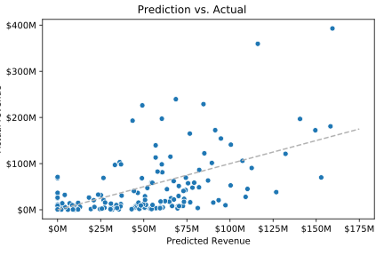
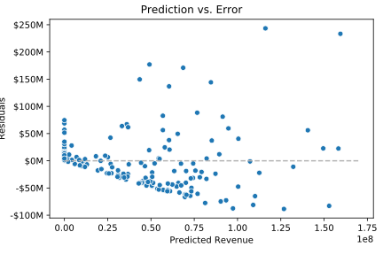
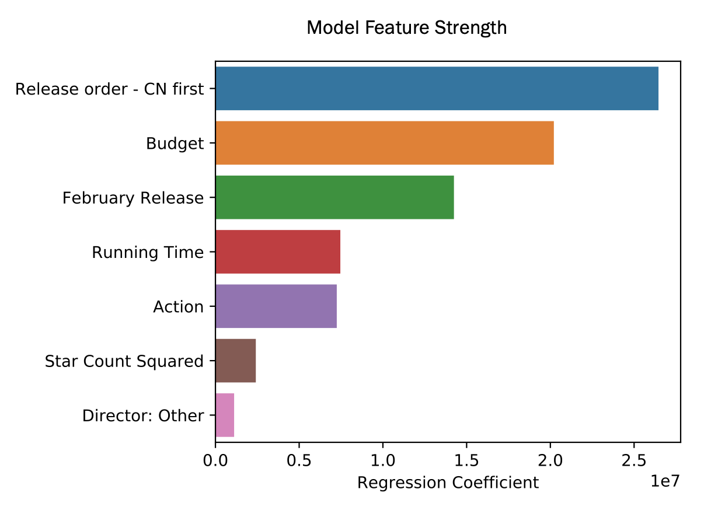

# **Chinese Box Office Analysis**: Interpreting International Film Performance in Mainland China

Max Currier

## Background
Mainland Chinese box office revenue alone constitutes roughly 1/3 of the global market. A greater understanding of this market can significantly boost worldwide film revenue.

  

## Methodology

My goal was to **generate key insights to improve international film marketing strategy**. To do that I **used linear regression to interpret total gross revenue** of internationally released films in the mainland Chinese market.

All data for this project was scraped from the following sources uaing BeautifulSoup:

* Box Office Mojo
  * Worldwide box office data 1994-2020
  * Out of ~16K films total, only ~800 released in China
  * HK excluded since it requires a unique marketing approach

* The Numbers
  * Top 100 earning international actors

* Wikipedia
  * Top 10 highest-grossing film directors worldwide

## Challenges

I faced a number of challenges while working on this project. First, as you can see from the following graph, the target variable (revenue) was heavily skewed.

Additionally, many features in my model initially lacked strong correlation, and other features were missing lots of data, so I had to impute values for important features like budget, where 50% of values were missing. To impute budget values, I constucted another linar regression model that predicted budget based off of running time, genre, wordwide gross revenue, and cast. Below you can see the strong correlation between budget and running time that helped me to model this feature.

The results of this model within a model were an R^2 of 0.676 and an MAE of 25,779,893, which can be interpreted to mean that 2/3 of budget variance can be explained by the model and that predictions accurate within margin of ~$26M.

## Key Factors Influencing Revenue

When feature engineering, I domain knowledge and experimentation to engineer and select features with best correlation with revenue, A/B testing feature combinations using R^2 to judge results. Unfortunately the data set was too small to benefit from regularization and/or widespread polynomial feature adoption.

## Revenue Modeling Results

With an R^2 of 0.306 and and MAE of 38,373,286, the model is able to explain 30% of revenue variance and predictions are accurate within ~$38 million.

Error analysis shows that the model tended to overpredict smaller films and underpredict whales. However, the model’s real strength lies in interpretation of feature strength rather than revenue prediction.

## Strategic Insights

The Chinese film market requires specific strategic considerations, especially in when it comes to release timing, budget spend, and film genre.

1. Timing matters
  * Release during Lunar New Year
  * Don’t delay Chinese release

2. High budget yields high revenue

3. Action translates to foreign audiences easily

## Future work
1. Extrapolate: Incorporate insights from broader international film market data and extend to analysis of Chinese market

2. Add: Continue to add features
	* Chinese reviews/ratings (douban.com)
	* Chinese cast
	* Comparisons with domestic Chinese films

3. Update: Incorporate new film data as it becomes available

## Tools

* Jupyter Notebook
* Scikit-learn
* Pandas
* Numpy
* BeautifulSoup
* Seaborn
* Matplotlib
* Statsmodels
* Patsy
